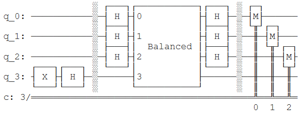
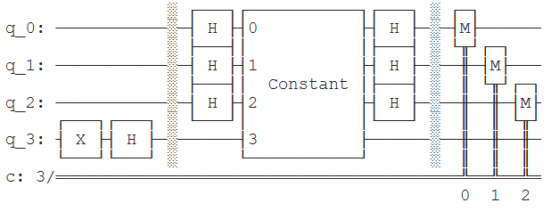

# $\text{Deutsch-Jozsa Algorithm}$

The **Deutsch–Jozsa algorithm** is one of the earliest quantum algorithms demonstrating a clear advantage over classical computation. It determines whether a given Boolean function is constant (producing the same output for all inputs) or balanced (producing equal numbers of 0s and 1s) using only one evaluation of the quantum oracle, whereas a classical algorithm may require exponentially many evaluations in the worst case.

## $\text{Purpose}$
- Studying the **Deutsch-Jozsa algorithm** from scratch using Qiskit
- Creating effective and efficient modules for **Deutsch-Jozsa algortihm**

## $\text{Feature}$
This implementation constructs the algorithm from scratch using quantum gates, prepares the superposition state with Hadamard transforms, applies the oracle, and performs interference to reveal the global property of the function with a single measurement.

## $\text{Installation}$
Clone repository with `git clone https://github.com/celfienseptianwp/deutsch-jozsa.git` and use `pip install -r requirements.txt` in terminal to install dependencies.

## $\text{Success Indicators}$
The algorithm is successful if the final measurement yields the state `|0...0⟩` for a constant function, and any non-zero state for a balanced function.

## $\text{Result}$
<p align="center">
  
  
</p>

Based on the research that has been conducted, the following results were obtained:
| Oracle | Measurement | Probability |
|--------|-------------|-------------|
| Constant | `000` | 1 |
| Balanced | `111` | 1 |

Therefore, this study has satisfied the success indicator.

## $\text{File Structure}$
```text
├── _pycache_/
├── assets/
│   ├── balanced.png
│   └── constant.png
├── quantum_algorithms.py
├── README.md
├── requirements.txt
└── validation.ipynb
```

## $\text{References}$
Nielsen, M. A., & Chuang, I. L. (2010). Quantum Computation and Quantum Information (10th Anniversary ed.). Cambridge University Press.

## $\text{Licence}$
This project uses the MIT License.


